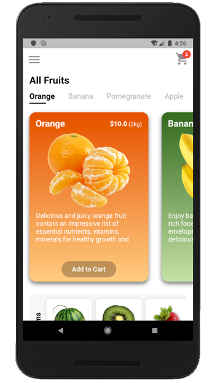
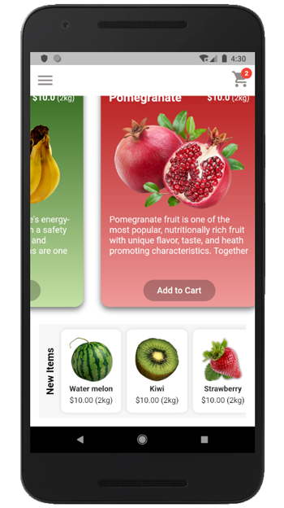
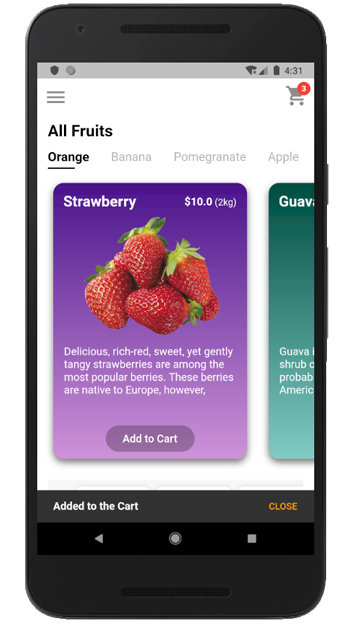
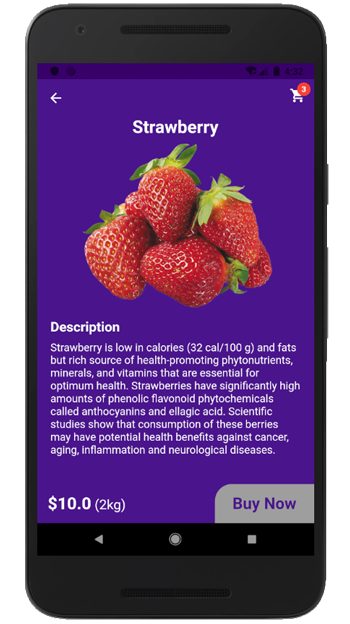

# Fruit APP UI - Developed in Flutter

We try to build a UI in flutter based on the [dribble](https://dribbble.com/shots/6439039-Fruit-App) design.

All the images are downloaded from [StickPNG](https://www.stickpng.com/)

---

### Home Page

### Add to Cart and Details page

